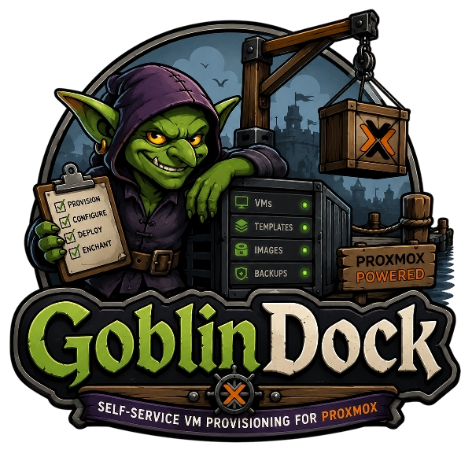
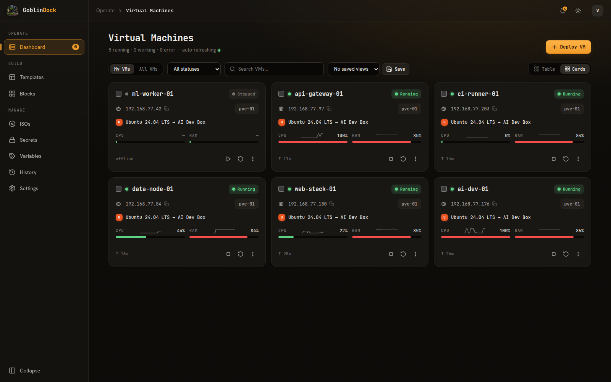
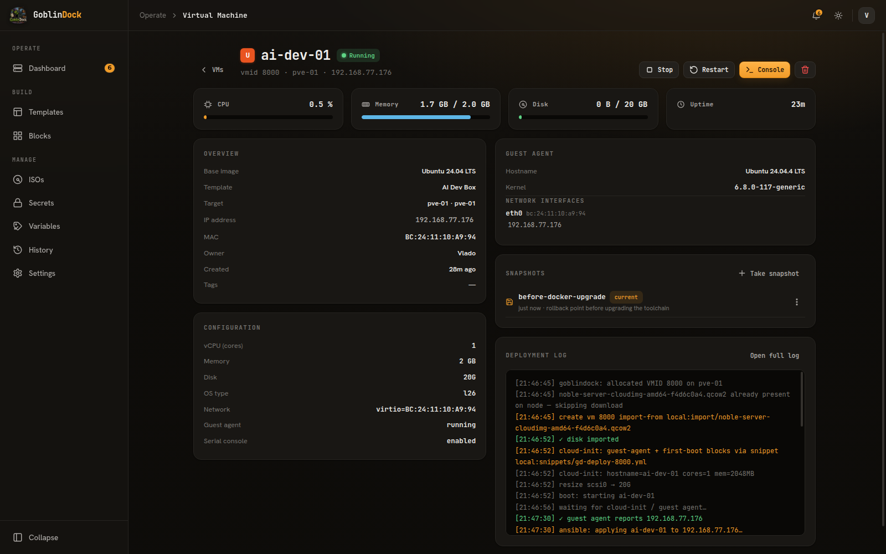
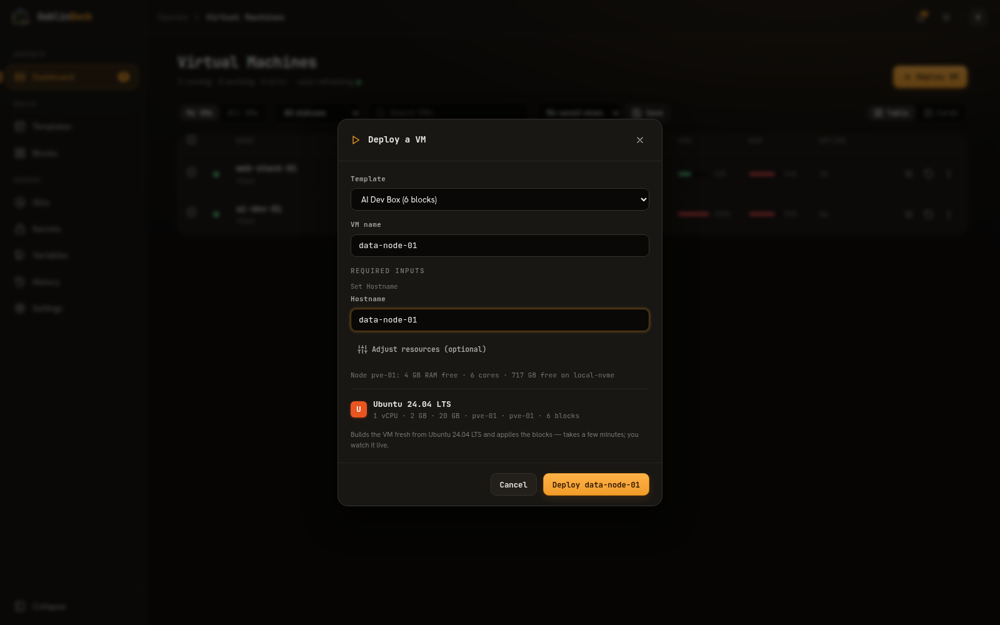
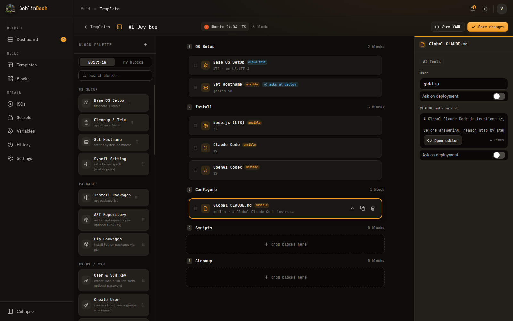
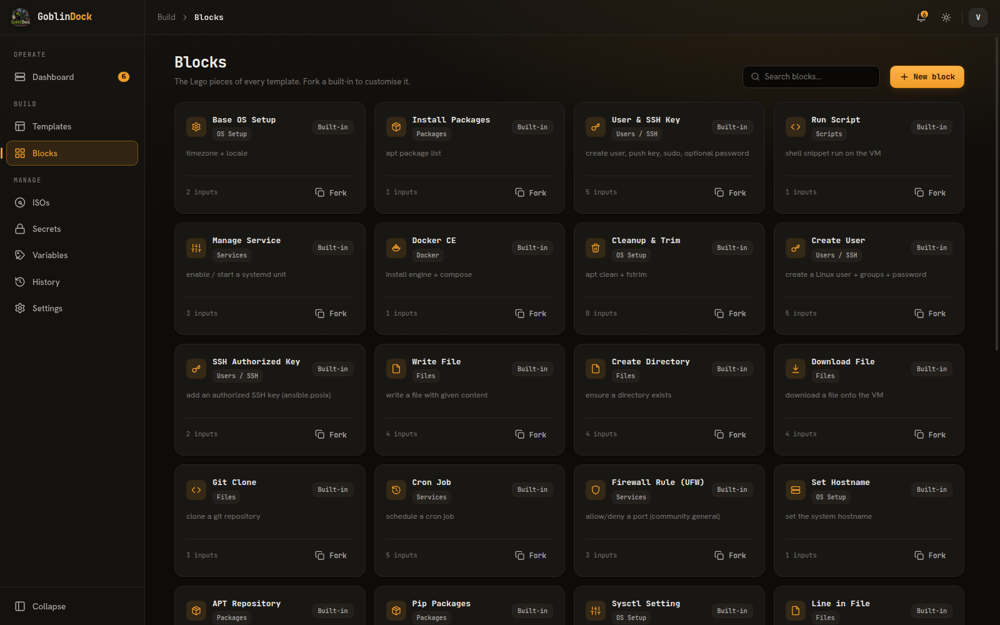
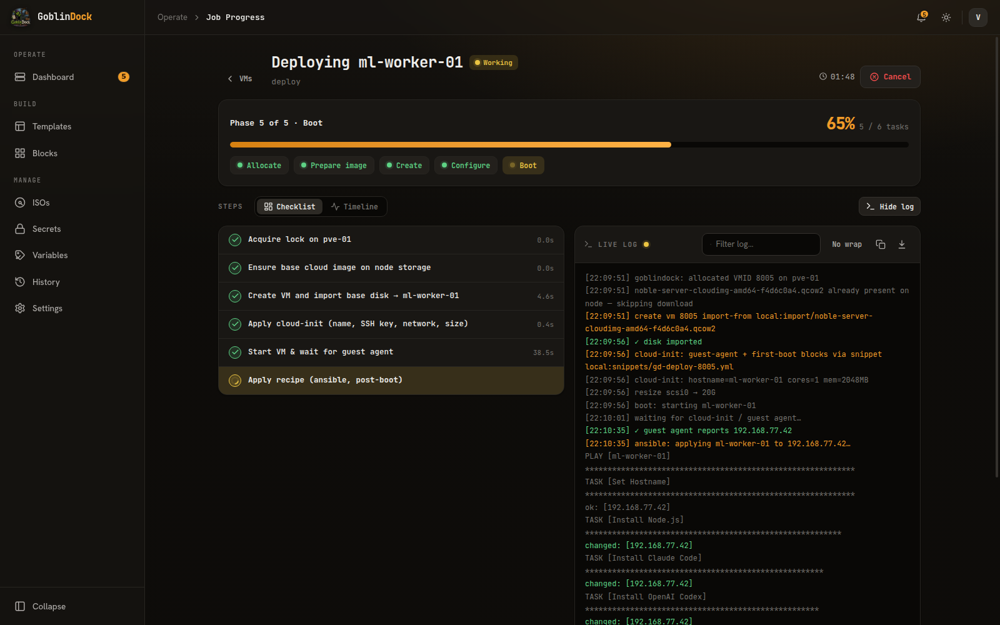

<div align="center">



# GoblinDock

**A self-hosted, multi-user control panel for Proxmox VE.**

[](https://github.com/VladoPortos/GoblinDock/actions/workflows/ci.yml)
[](https://github.com/VladoPortos/GoblinDock/actions/workflows/codeql.yml)
[](https://github.com/VladoPortos/GoblinDock/actions/workflows/trivy.yml)
[](https://scorecard.dev/viewer/?uri=github.com/VladoPortos/GoblinDock)
[](LICENSE)
[](https://goblindock.com)
[](https://github.com/VladoPortos/GoblinDock/pkgs/container/goblindock)

<!-- OpenSSF Best Practices: register the project at https://www.bestpractices.dev/ then add:
[](https://www.bestpractices.dev/projects/<ID>) -->

**[goblindock.com](https://goblindock.com)** · `docker pull ghcr.io/vladoportos/goblindock:latest`

Build fully-configured VMs in a click from reusable templates,
and manage them — live metrics, deployment log, and a real **graphical console** —
all from a single container backed by one SQLite file.

</div>



---

## What it does

GoblinDock turns *"spin up a fully-configured VM"* into a few clear buttons:

- **🧱 Templates from blocks** — assemble a base cloud image + a stack of customization
  blocks into a reusable **template** (e.g. *AI Dev Box*, *MySQL node*). Cloud-init blocks
  run at the VM's first boot; ansible blocks run post-boot — all compiled from the canvas.
- **🚀 One-click deploy** — pick a template, name the VM, answer any inputs the template
  asks for at deploy time (a fresh hostname, a password…), optionally tweak the size — and
  GoblinDock provisions, configures, and tracks the VM, reporting its IP back via the
  guest agent. The target node, network and defaults all come from the template.
- **🖥️ Per-VM detail page** — live CPU / RAM / disk usage, full config, guest-agent OS
  & network info, the deployment log, and a built-in **console** (graphical VGA *and*
  serial — the same noVNC console Proxmox uses).
- **🛠️ Lifecycle** — start / stop / restart / **rebuild** / **destroy**, all from the
  dashboard or detail page.
- **📸 Snapshots** — take, roll back and delete Proxmox-native snapshots (optionally
  with RAM state) right from the VM detail page — snapshot before risky changes,
  roll back in seconds.
- **📺 Live jobs** — every long action is a job with a step checklist, progress bar, and
  a streaming log over SSE — including live download progress while a node pulls a cloud
  image, and queued jobs say which running job they're waiting for.
- **👥 Multi-user** — first-run admin setup, Admin / User roles, per-user VM isolation,
  per-target resource limits, and an audit log.



---

## Quick start (Docker)

```bash
# 1. a stable secret key (signs sessions + encrypts stored secrets/tokens)
python3 -c "import secrets; print('GOBLINDOCK_SECRET_KEY='+secrets.token_hex(32))" > .env

# 2. Proxmox API token in a gitignored env file:
#    .secrets/proxmox-test.env  ->  PROXMOX_TOKEN_ID, PROXMOX_TOKEN

# 3a. PRODUCTION default — pulls the prebuilt image from GHCR, binds 127.0.0.1,
#     Secure cookies, no auto-seed. Front it with a TLS-terminating reverse proxy;
#     add the Proxmox connection in the UI. (Add `--build` to build from source instead.)
docker compose up -d

# 3b. LOCAL DEV — layer the dev override for http cookies + an auto-seeded test
#     connection from .secrets/proxmox-test.env (publishes on all interfaces):
docker compose -f docker-compose.yml -f docker-compose.dev.yml up -d

open http://localhost:8080
```

> The image is published at **`ghcr.io/vladoportos/goblindock`** — multi-arch
> (amd64 · arm64). Tags: `latest` (newest release), `main` (rolling, from the default
> branch), and semver (`2.1.2`, `2.1`). The compose files pull `:latest` by default.

The first load shows **"Create the first admin account"**. With the dev override the
Proxmox connection is auto-seeded from `PROXMOX_*` (`GOBLINDOCK_SEED_PROXMOX=true`); in
the production default you add it from **Settings → Proxmox**. Behind a reverse proxy,
set `GOBLINDOCK_FORWARDED_ALLOW_IPS` to the proxy IP/CIDR so audit logs and the login
throttle see the real client address.

---

## Concepts

| Thing | What it is |
|------|------------|
| **Connection (target)** | A Proxmox node/cluster + token. Each target sets its own **per-VM ceilings** (max vCPU / RAM / disk). |
| **ISO / base image** | A public cloud image (e.g. Ubuntu 24.04) — the raw material every deploy builds from. The ISOs page shows whether it's already cached on a node and can **pre-sync** it there ahead of the first deploy. |
| **Template** | A named deployment preset: a base cloud image + location + blocks + default resources (e.g. *AI Dev Box*, *MySQL node*). Block inputs can be flagged **ask on deployment** — every deploy then prompts for fresh values (hostname, password…). Deploy in one click. |
| **Block** | One customization step (install a package, join your tailnet, deploy a compose stack, install Claude Code…). 44 built-ins + your own. |
| **Secret / Variable** | Reusable values referenced as `{{ secrets.NAME }}` (encrypted) or `{{ variable.NAME }}` (plaintext, visible). |

The flow: **add a base image (or use the seeded ones) → build a template (blocks + location + size) → deploy.**



---

## How the customization actually runs

This is the part people are curious about. When you stack several blocks, GoblinDock
**doesn't run them one-by-one as separate executions** — it *compiles* them.



There are 44 built-in blocks (plus your own forks and custom ones) — networking
(Tailscale, K3s), security (SSH hardening, Fail2ban, internal CA, unattended upgrades),
Docker (Compose stacks, Watchtower, Portainer agent), databases (MariaDB, PostgreSQL,
Redis), storage, AI tooling and more — each tagged with the phase it runs in:



### Two phases

Every block declares a **phase**, shown as a badge in the builder:

| Phase | When it runs | How | Example blocks |
|-------|--------------|-----|----------------|
| **cloud-init** | at the VM's **first boot**, as root | merged into one shell script delivered as a cloud-init snippet | Base OS Setup, User & SSH Key, Console Password, Cleanup |
| **ansible** | **post-boot**, after the VM is up | merged into one Ansible playbook run over SSH | Install Packages, Docker CE, Run Script, the AI-tools blocks |

### Same phase → one merged execution, in order

All your **cloud-init** blocks are concatenated into a **single shell script**
(`set -e` up front, one `echo ">>> GoblinDock: <block>"` marker before each), and all
your **ansible** blocks become **one playbook** — *one play, one task per block*. Order
is preserved exactly as on the canvas: **section order** (OS Setup → Install → Configure
→ Scripts → Cleanup) then **top-to-bottom** within a section.

So three ansible blocks aren't three SSH sessions — they're three tasks in one playbook,
run sequentially in a single `ansible-runner` invocation. Three cloud-init blocks are
three chunks of one boot script.

### Worked example

Stack these four blocks:

```
OS Setup   ▸ Base OS Setup      (cloud-init)
Install    ▸ Install Packages   (ansible)
Install    ▸ Docker CE          (ansible)
Scripts    ▸ Run Script         (ansible)
```

GoblinDock compiles them into **two artifacts** and runs them **in sequence**:

```text
# 1) first boot — cloud-init runcmd  (one script, runs as root)
set -e
echo '>>> GoblinDock: Base OS Setup'
timedatectl set-timezone UTC || true
localectl set-locale LANG=en_US.UTF-8 || true

# 2) post-boot — ansible playbook  (one play, runs over SSH as the goblin user)
- name: deploy-gd-vm
  hosts: all
  become: true
  tasks:
    - name: Install Packages
      ansible.builtin.apt: { name: ["htop","jq"], state: present, update_cache: true }
    - name: Install Docker CE
      ansible.builtin.shell: curl -fsSL https://get.docker.com | sh
    - name: Run Script
      ansible.builtin.shell: |
        <your script>
```

You can see the exact generated playbook any time with **View YAML** in the builder.

### How a deploy works

Every deploy builds the VM **fresh from the base cloud image** — cloud-init blocks run
at first boot (timezone, users, boot scripts), ansible blocks run post-boot (packages,
Docker, Claude Code, etc.). No pre-baked template image is needed. The first deploy from
a given base image downloads it onto the node (cached per node afterwards — or pre-sync
it from the ISOs page); a deploy typically takes a few minutes, and the job page streams
every step live, download progress included.



### Engines & plumbing

- **cloud-init** is delivered as a per-VM snippet over SSH (`cicustom=user=…`).
- **ansible** runs via **ansible-runner inside the container**, SSHing into the VM as the
  `goblin` user using a GoblinDock-managed keypair injected at deploy. Collection-backed
  blocks (ansible.posix, community.general/docker/postgresql) ship in the image.
- **Inputs and secrets are data, not code** — every value spliced into a cloud-init shell
  line *or* an Ansible `shell:` command is shell-quoted (and YAML-quoted where it lands in
  a playbook scalar), so a password or value containing shell metacharacters can't break
  the run or inject. Only the explicit *Run Script* / launcher-command fields are
  intentionally arbitrary shell — on your own VM. Password-typed inputs are masked in the
  builder (with a confirm box) and replaced with `********` in the YAML preview.
- `{{ secrets.NAME }}` / `{{ variable.NAME }}` are resolved at run time (secrets stay
  server-side and are masked in previews/logs).

---

## The console

Open any VM → **Console**. Two tabs:

- **Graphical** — the same **noVNC** console Proxmox uses, rendering the VM's VGA display.
  GoblinDock proxies the VNC WebSocket so the browser only ever talks to GoblinDock (the
  Proxmox token stays server-side).
- **Serial** — an `xterm.js` serial console.

Cloud images set up SSH-key login with **no console password**, so add the **Console
Password** block to your template if you want to log in at the console.

---

## Architecture

One Docker container, no external services:

- **FastAPI + Uvicorn** — REST API, SSE job streams, WebSocket console proxies, and the
  static SPA.
- **Worker** — a daemon thread that claims queued jobs from SQLite and drives Proxmox
  (download/import, VM create, cloud-init, ansible, lifecycle), writing step/log events.
- **SQLite (WAL)** — the *entire* data store **and** the job/event log. No Redis, no Postgres.
- **SPA** — vendored React (`React.createElement`, no build step), CodeMirror (script
  editor), xterm.js + noVNC (consoles) — all served from `web/`, SRI-pinned.

```
backend:  app/*.py   (FastAPI app + routes · threaded job worker · APScheduler · Proxmox client · template compiler · SQLite models)
frontend: web/{index.html,styles.css,*.js, vendor/}
```

Proxmox work is **pure API** (download, import, VM create, lifecycle, vnc/term proxy); a node
**SSH key** is used only to drop cloud-init snippets. Without SSH the app still deploys —
it falls back to native cloud-init.

---

## Configuration (env)

| Var | Default | Purpose |
|---|---|---|
| `GOBLINDOCK_SECRET_KEY` | — | session signing + at-rest encryption (**set a long, stable value**). Supports `GOBLINDOCK_SECRET_KEY_FILE` for Docker secrets. |
| `GOBLINDOCK_FORWARDED_ALLOW_IPS` | — | behind a reverse proxy, set to the proxy IP/CIDR so the real client IP is used for the login throttle + audit log |
| `GOBLINDOCK_VMID_MIN` / `_MAX` | `8000` / `8099` | VMID window GoblinDock may ever touch |
| `GOBLINDOCK_MAX_CORES` / `_RAM_MB` / `_DISK_GB` | `1` / `2048` / `0` | global per-VM ceilings (a connection can set its own) |
| `GOBLINDOCK_MAX_VMS_PER_USER` | `0` | per-user VM quota (`0` = unlimited; admins exempt) |
| `GOBLINDOCK_DATA_DIR` / `GOBLINDOCK_DB` | `./data` / `<data>/goblindock.sqlite3` | data directory and SQLite file path |
| `GOBLINDOCK_BACKUP_ENABLED` / `_INTERVAL_HOURS` / `_KEEP` / `_DIR` | `1` / `24` / `7` / `<data>/backups` | scheduled **online SQLite backups** (WAL-safe, rotating; backups carry the same encrypted secrets and need the matching `GOBLINDOCK_SECRET_KEY` to restore) |
| `GOBLINDOCK_ADMIN_EMAIL` / `_PASSWORD` / `_NAME` | — | optional first-run admin bootstrap (skips the setup screen) |
| `GOBLINDOCK_CORS` | — | comma-separated extra allowed origins (CORS **and** the console WebSocket origin allow-list) |
| `GOBLINDOCK_COOKIE_SECURE` | on (off in dev) | override the session cookie `Secure` flag |
| `GOBLINDOCK_SSH_STRICT` / `GOBLINDOCK_SSH_KNOWN_HOSTS` | `false` / — | SSH host-key verification for snippet upload: strict rejects unknown hosts; point `_KNOWN_HOSTS` at a pinned `known_hosts` file |
| `GOBLINDOCK_SEED_PROXMOX` | `false` | auto-create the connection from `PROXMOX_*` |
| `PROXMOX_TOKEN_ID` / `PROXMOX_TOKEN` | — | Proxmox API token (keep in gitignored `.secrets/`; `PROXMOX_TOKEN_FILE` works for Docker secrets) |
| `PROXMOX_HOST` / `_NODE` / `_STORAGE` / `_BRIDGE` | — | connection defaults |
| `PROXMOX_ISO_STORAGE` / `_SNIPPET_STORAGE` | `local` / `local` | storage for downloaded cloud images / cloud-init snippets |
| `PROXMOX_SSH_HOST` / `_SSH_USER` / `_SSH_KEY` | — | node SSH (enables snippet baking + IP detection) |
| `GD_UID` / `GD_GID` | `1000` | run the container as your host user (for bind-mounted `./data` + SSH key) |
| `GOBLINDOCK_WEB_DIR` | `./web` | serve the SPA from a different directory |
| `GOBLINDOCK_DEV` | unset | allows http / non-Secure cookies + an ephemeral secret key for localhost. **Never set in prod.** |
| `GOBLINDOCK_ALLOW_EPHEMERAL_KEY` | unset | start without a stable secret key **outside** dev mode (sessions and stored secrets reset on every restart — escape hatch only) |

---

## Security

> **Run with a single worker.** GoblinDock keeps some state in-process (login
> throttle, the background job worker, VNC handshake tokens, the IP-allocation lock
> and first-run setup lock). Run uvicorn with `--workers 1` (the default / shipped
> Dockerfile) and do not scale to multiple replicas without an external shared store.

- **Auth** — signed, httpOnly session cookie with **session versioning** (a password
  change or admin reset revokes all other existing sessions); every mutating + job
  endpoint checks ownership (a User only sees/controls their own VMs; Admins see all).
  Login is rate-limited per-IP **and** locks an account after repeated failures;
  password policy enforced. Disabled accounts are rejected on **every** path, including
  the console / VNC WebSockets (which also enforce a same-origin check).
- **Tenant isolation** — `/api/state` is role-filtered: a non-admin only ever receives
  their own VMs, a **redacted** connection view (no Proxmox host / token id / SSH
  paths, no user directory) and a **redacted** network view (no bridge / VLAN / subnet /
  gateway / DNS — just enough to pick one). Templates and blocks honour visibility — a
  private one can't be deployed, compiled, or forked by guessing its id. Optional
  per-user VM **quota** (`GOBLINDOCK_MAX_VMS_PER_USER`).
- **Host-key / TLS verification** — Proxmox API TLS (`verify_tls`, per connection) and
  SSH host-key checking (`GOBLINDOCK_SSH_STRICT` + `known_hosts`) default to trust-on-
  first-use for a homelab LAN; **enable both** when the control plane is reachable from
  an untrusted network. (The post-boot Ansible leg over SSH is TOFU by design for
  ephemeral VMs.)
- **Encryption at rest** — secrets and Proxmox tokens are Fernet-encrypted (HKDF-derived
  from `GOBLINDOCK_SECRET_KEY`) and masked in logs/previews.
- **Guard rails** — a hard VMID-window check in the Proxmox client (GoblinDock can never
  touch a VM outside its window), an SSRF check on image URLs (https + public IPs only),
  CSRF synchronizer tokens, security headers + CSP, self-hosted fonts.
- **Container** — non-root, digest-pinned base, version-pinned deps (`requirements.txt`)
  and pinned Ansible collections (`collections/requirements.yml`).
- A clock-skew-tolerant session signer (WSL2/VM clocks can jump backwards and otherwise
  invalidate fresh cookies).

> Guard rails: GoblinDock only ever acts on VMIDs inside a configurable window
> (default **8000–8099**) and VMs are capped to per-target CPU/RAM/disk ceilings, so it
> can run safely alongside existing workloads on a node.

---

## Reliability & hardening

GoblinDock went through a security + correctness review (independently verified end to
end). Among the guarantees it now makes:

- **Jobs fail loudly** — a failed Proxmox task (import / VM create / start / destroy) fails
  the job instead of being logged as success, so the DB never advances past a VM that
  wasn't actually created or destroyed.
- **Per-target ceilings are enforced end-to-end** — requested vCPU / RAM / disk is clamped
  to the connection's limits all the way to the worker, and a connection may raise its
  limits *above* the global default.
- **Deploys target the right node** — a VM is always built on the node set in the
  template's connection.
- **Rebuild keeps identity** — a rebuilt VM keeps its **static IP / VLAN** (and the
  original disk size) instead of reverting to DHCP / 20 GB.
- **Static IPs can't double-book** — allocation is serialized and backed by a unique
  `(network, ip)` index.
- **`GET /api/state` is read-only** and only serializes the VMs you're allowed to see — no
  lazy DB writes, and no live-probing other users' VMs on the polling path.

---

## Homepage widget

GoblinDock exposes a small, read-only JSON endpoint for a
[Homepage](https://gethomepage.dev) dashboard tile — counts of your VMs, active jobs and
templates, and nothing else. It needs **no plugin and no PR to Homepage**: the
built-in `customapi` widget does it all from `services.yaml`.

1. In GoblinDock, open **Profile → Homepage widget → Generate key** and copy the key — it
   is shown **once** and stored only as a hash.
2. Add it to Homepage's `services.yaml` (Homepage fetches the endpoint server-side, so the
   key never reaches a browser):

```yaml
- GoblinDock:
    href: https://goblindock.example.com
    widget:
      type: customapi
      url: https://goblindock.example.com/api/widget/summary
      refreshInterval: 15000
      headers:
        X-API-Key: "{{HOMEPAGE_VAR_GOBLINDOCK_KEY}}"
      mappings:
        - { field: vms_running,   label: Running, format: number }
        - { field: vms_total,     label: VMs,     format: number }
        - { field: jobs_active,   label: Jobs,    format: number }
        - { field: templates,     label: Templates, format: number }
```

The key is **per-user and read-only** — it authenticates only `GET /api/widget/summary`
(scoped to its owner: a User sees their own counts, an Admin sees all) and can never
deploy, read, or change anything. **Regenerate** rotates it (the old key dies immediately)
and **Revoke** disables it, both from the Profile page. Available fields: `vms_total`,
`vms_running`, `vms_stopped`, `vms_working`, `vms_error`, `jobs_active`, `templates`.

---

## Tech stack

FastAPI · Uvicorn · SQLModel/SQLite (WAL) · proxmoxer · ansible-core + ansible-runner ·
paramiko · cryptography · React (vendored) · CodeMirror · xterm.js · noVNC.

## License

Released under the [Apache License 2.0](LICENSE).

---

<div align="center"><sub>Built for a homelab Proxmox cluster. One container, one file, no moving parts.</sub></div>
